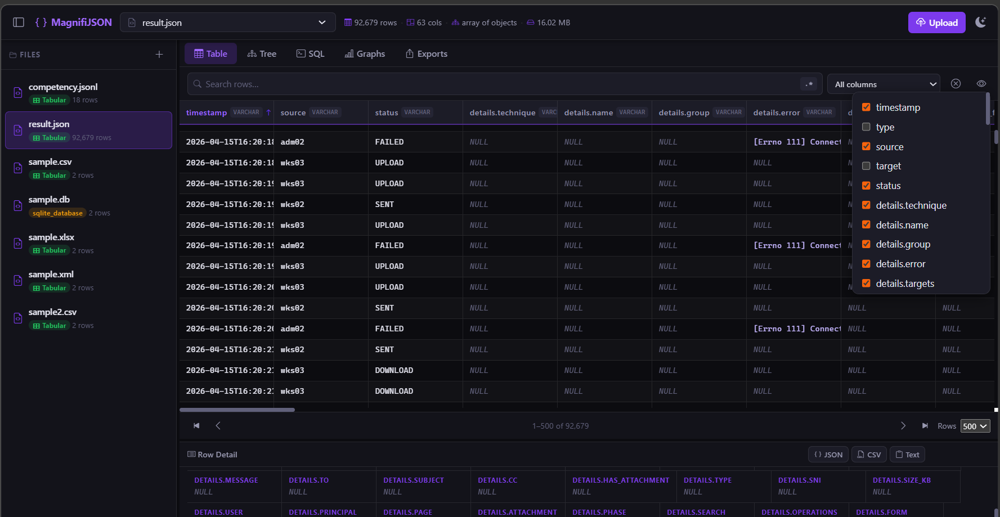
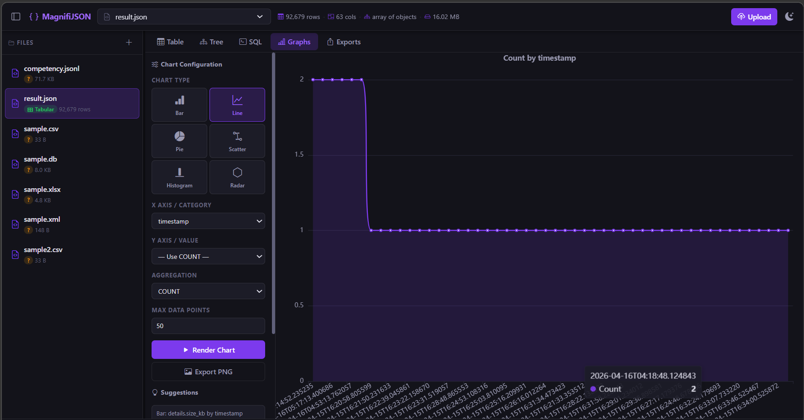
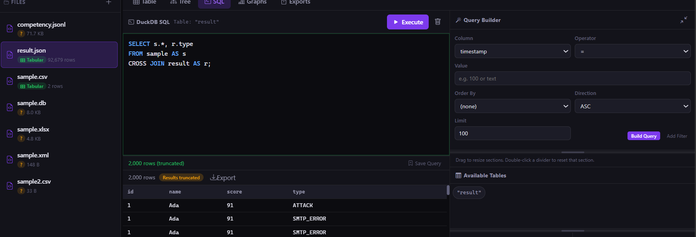

# MagnifiJSON

MagnifiJSON. It's a Joke on Magnification. Because we are trying to zoom in on JSON data... It's a little funny...



MagnifiJSON is a dual-app project for exploring structured data:
- WebUI (FastAPI + DuckDB)

I was debating if I wanted SQLite or DuckDB for the query engine, but I went with DuckDB because it has better support for JSON. Since it's a JSON tool, I figured, why not.



## Supports

- **File Ext:** JSON / JSONL / NDJSON / CSV / XML / YAML / XLSX / SQLITE
- Search with RegEx
- Search using SQL Query with some Query builder features
- Export or Copy
- View in Tree or Table format
- Auto-detect file structure and flatten for easier querying
- Customizable Graphs and Charts



## Quick Start

### WebUI (Docker)

```bash
docker compose up --build
```

### DockerHub

```bash
docker pull jonesckevin/magnifijson:latest
docker run -it --rm -p 9002:8080 -v ./upload:/app/upload -v ./exports:/app/exports jonesckevin/magnifijson:latest
```

Open: http://localhost:9002

### WebUI (Local Python)

```bash
cd app
pip install -r requirements.txt
uvicorn main:app --reload --host 0.0.0.0 --port 8080
```

Open: http://localhost:8080

## Notes

- Uploaded files and exports for the WebUI are stored in `upload/` and `exports/`.
